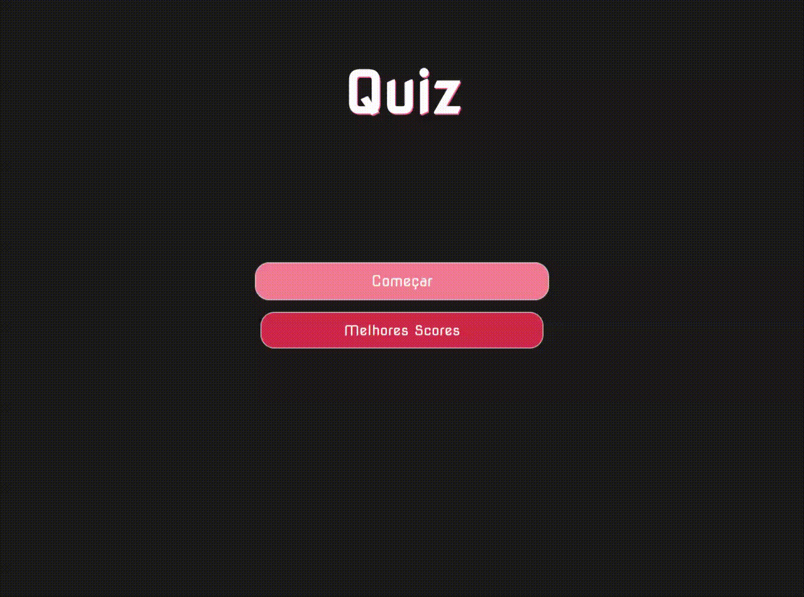
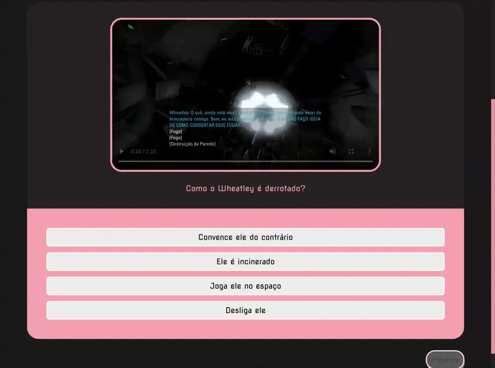

# Gênio Quiz 2000

Um quiz de 10 perguntas randômicas de mais de 30 perguntas pré-establecidas sobre entreterimento em geral. Com possibilidade de reiniciar durante o jogo, voltar a Home Page e ver a tabela dos 10 melhores jogadores no começo e final do jogo.
_As perguntas foram elaboradas, porém os arquivos de mídia(imagem, vídeo, áudio) não são autorais._

**O objetivo final  desse quiz é educacional como primeiro contato com JavaScript e sua manipulação da DOM.**

## :open_file_folder: Acesso ao Projeto 

Você pode baixá-lo ou entrar na [página gerada pelo Github](https://wanessakoserski.github.io/quiz-html-css-js/).

## :joystick: Funcionalidades do projeto

- `Começar`: Randomizar as 10 perguntas e começar o jogo;
- `Melhores Scores`: Abrir e fechar a tabela dos 10 melhores jogadores até o momento;
> É utilizado localStorage, então é apenas considerado quem jogou naquele browser
- `Home Page`: Voltar para a tela inicial. E caso, não tenha chegado ao final, perde todo o progresso do jogo;
- `Reiniciar`: Reseta todo o progresso e randomiza novamente as 10 perguntas;
- `Próximo`: Esconde a pergunta atual e mostra a próxima da fila;
- `Adicionar` ou `Enter`: Adicionar o nome com o score somado na partida e comparar com dos outros jogadores para determinar sua posição no rank;
- `Voltar para página inicial`: Voltar para página inicial e resetar todos os dados da partida anterior.

## :heavy_check_mark: Técnicas e tecnologias utilizadas
 
- HTML e CSS
- JavaScript
    - DOM para gerenciar eventos e dinamicidade da página
    - JSON e localStorage para guardar informações
